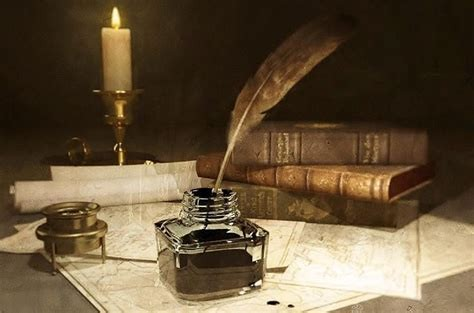

# indian writers🖋️

---
**1.Rabindranath tagore**:
Rabindranath Thakur FRAS was an Indian Bengali polymath who worked as a <u> poet, writer, playwright, composer, philosopher, social reformer, and painter of the Bengal Renaissance </u>. He reshaped Bengali literature and music as well as Indian art with Contextual Modernism in the late 19th and early 20th centuries.  
**2.Rk narayan**:
Rasipuram Krishnaswami Narayanaswami, better known as R. K. Narayan, was an Indian writer and novelist known for his work set in the fictional South Indian town of <u>**Malgudi**</u>. He was a leading author of early Indian literature in English along with Mulk Raj Anand and Raja Rao.  
**3.Arundhati roy**:
Suzanna Arundhati Roy is an Indian author best known for her novel `The God of Small thing`, which won the Booker Prize for Fiction in 1997 and became the best-selling book by a non-expatriate Indian author. She is also a political activist involved in human rights and environmental causes.  

## Theme of indian writers:
- Historical, Political and Nationalist themes, Social realism, Indian diaspora and Immigration, Individual Experiences, Feminism and Women's Empowerment.